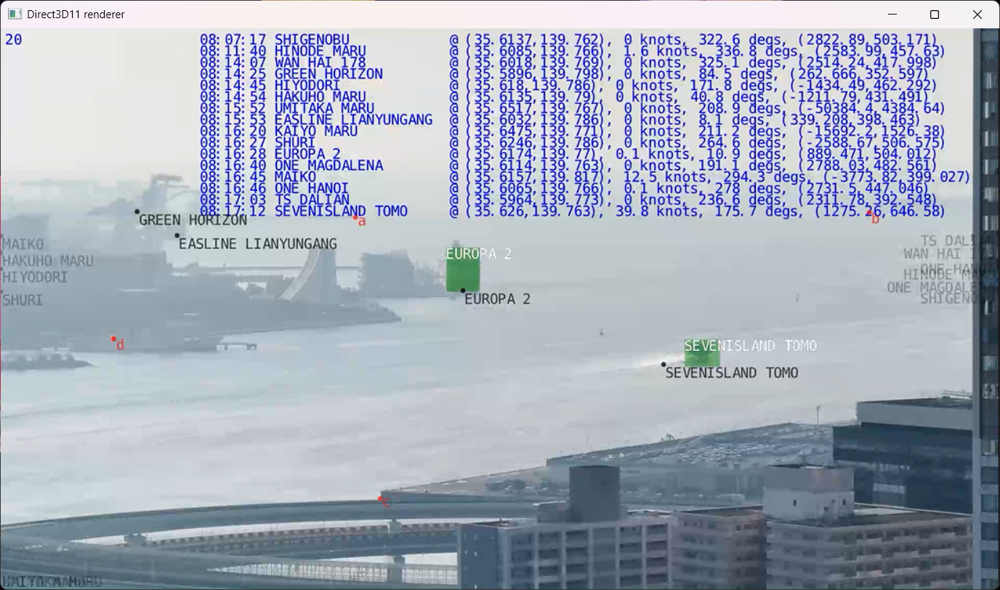

# Ship Explorer

## Overview

Ship Explorer は、船舶を SSD-Mobilenet v1 ベースの AI モデルで物体検出し、ビデオ撮影時の AIS (Automatic Identification System) 情報をもとに、船名候補をバウンディングボックス内に表示するシステムである。



本プロジェクトは [dusty-nv/jetson-inference](https://github.com/dusty-nv/jetson-inference) の [examples/detectnet](https://github.com/dusty-nv/jetson-inference/tree/master/examples/detectnet) をベースに作成している。

AI モデルは高所 (ビル) から海面を見下ろすように撮影した船舶の画像を使用し、アノテーションを施した後に転移学習を行った。AIS 情報は [aisstream.io](https://aisstream.io/) から取得している。

## 特徴

* モデルの TensorRT 化による高速な物体検出
  * Full HD の動画に対して十分なフレームレート (15 fps 前後)
* CUDA を用いた効率の良いオーバーレイ描画
* 物体検出と AIS 情報のフュージョン
  * 4 つの地図上の点 (latitude, longitude) とそれぞれと対応する動画上の点 (x, y) から求めた射影行列を用いて、候補となる船舶位置を動画上に表示
  * 物体検出した船舶のバウンディングボックスの中心から最も近い位置にある候補船舶の名前をバウンディングボックス内に表示
* Ship Explorer 向けに最適化された SSD-Mobilenet v1 モデル
  * 追加のデータセットを用いて転移学習

## 環境

* 計算環境
  * 推論: NVIDIA Jetson TX1
  * 学習: NVIDIA GeForce RTX 4070 Ti, Intel Core i7-13700K, 32 GB RAM
* 撮影環境 (データセット収集・推論時)
  * 機材: Apple iPhone 16 Pro
  * 解像度: 1920 x 1080
  * フレームレート: 30 fps
  * 光学 5 倍ズーム、120mm、ƒ/2.8 絞り値
* その他
  * Jetson を遠隔地に設置したため出力映像を GStreamer 経由で閲覧 (with RTP, over VPN)

## プロジェクト構成

```
/jetson-inference/
├── build/                     # コンパイル済みバイナリ
├── data/                      # 入力データやサンプル
├── python/training/detection/ # 学習用スクリプト (SSD-Mobilenet v1)
├── tools/                     # AIS 情報取得ツール、RTP 受信用スクリプト
└── examples/ship_explorer/    # 本プロジェクトの主な実装
```

## セットアップ

### Jetson TX1 上

#### JetPack

[Setting up Jetson with JetPack](https://github.com/dusty-nv/jetson-inference/blob/master/docs/jetpack-setup-2.md) の手順を参考に Jetson TX1 へ JetPack 4.6.6 ([TX1 にインストール可能な最新版](https://developer.nvidia.com/embedded/jetpack-archive)) をインストールする。Jetson TX1 では JetPack のインストール方法として SDK Manager による方法のみをサポートすることに注意する。

ただしそのままの手順でインストールすると eMMC の容量不足によりインストールが失敗してしまう。対策として、先に最小のインストール項目だけを選択して eMMC へ JetPack をインストールし、eMMC のデータを SD カードにコピーして SD カードからのブート設定を行ってから JetPack のインストーラーを再度実行し、スキップした項目のインストールをする必要がある。

SD カードからのブート設定方法については[こちら](https://jkjung-avt.github.io/sd-rootfs-on-tx1/)の記事を参照されたい。

#### パッケージ

```shell
$ sudo apt update
$ sudo apt install libpython3-dev python3-numpy git-lfs libyaml-cpp-dev
```

#### ビルド

```shell
$ cd /path/to/jetson-inference
$ mkdir build
$ cmake ..
$ make -j2
```

### Windows or Ubuntu マシン上

#### GStreamer

Jetson TX1 から出力される映像をリアルタイムで受信・表示するために使用する。
Windows 環境の場合、[GStreamer の公式サイト](https://gstreamer.freedesktop.org/download/#windows)から runtime と development installer をダウンロードしてインストールする。

実行コマンド例:

```bat
> gst-launch-1.0.exe -v udpsrc port=1234 caps = "application/x-rtp, media=(string)video, clock-rate=(int)90000, encoding-name=(string)H264, payload=(int)96" ! rtph264depay ! decodebin ! videoconvert ! autovideosink
```

上記コマンドは jetson-inference/tools/gstreamer.bat から実行することができる。

#### Label Studio

アノテーションの際に使用する。

```shell
$ pip install label-studio
```

## 入力動画の撮影と AIS 情報の取得

Ship Explorer では船舶動画撮影時点の AIS 情報を事前に記録しておき、それを実行時に動画とともに入力する必要がある。

事前に jetson-inference/tools/get_ais.py を編集し、`APIKey` として aisstream.io の API キーを指定し保存する。
船舶検出対象となる動画を撮影する前に下記コマンドで AIS 情報をログファイルに保存する。

```shell
$ cd /path/to/jetson-inference
$ cd tools
$ python3 -u get_ais.py | tee -a ais_log.ndjson
```

船舶ごとに AIS 情報の発信間隔が異なるためため動画撮影の 10 分以上前から AIS 情報を取得・保存することを推奨する。
AIS 情報を取得・保存しながら、船舶検出対象となる動画の撮影を実施する。緯度経度からスクリーン座標への射影変換を行う関係上、動画撮影中はカメラを動かさないように注意すること。


## データセット収集・アノテーション

推論用に使用する動画と同じ撮影場所から撮影した動画からフレームのスクリーンショットを何枚か撮影してデータセットとなる画像を作成した。
それらのデータセットに対し [Label Studio](https://labelstud.io/) を用いてアノテーションを行った。
詳しい操作方法は Label Studio の [Quick start](https://labelstud.io/guide/quick_start) ガイドを参照のこと。

分類先のクラスは `Boat` の 1 種類のみとし、画像中の船舶部分にバウンディングボックスを配置した。
全ての画像に対するアノテーションが完了後、アノテーション結果を Pascal VOC XML 形式でエクスポートした。

Label Studio からエクスポートした Pascal VOC XML の出力ディレクトリには、jetson-inference の training/detection/ssd/train_ssd.py が求める全てのファイルが含まれていない。

Label Studio から出力したディレクトリ名が project-1-at-2025-03-10-16-37-70156aca のとき、下記ディレクトリ構造となるよう、不足しているファイルやディレクトリを作成する。

* project-1-at-2025-03-10-16-37-70156aca
  * Annotations/
    * *.xml
  * ImageSets/
    * Main/
      * train.txt
      * val.txt
      * test.txt
      * trainval.txt
  * JPEGImages/ (images からリネーム)
    * *.png
  * labels.txt

まず下記コマンドでデータセットに含まれる画像の basename 部分を取得し、これらを training 用、validate 用、test 用に振り分ける。
今回は training 用に 60%、validate 用と test 用にそれぞれ 20% となるように振り分ける。それぞれ train.txt、val.txt、test.txt に改行区切りで basename を列挙して作成し、最後に train.txt と val.txt を連結した trainval.txt を作成する。

```shell
$ cd /path/to/output/dir
$ ls Annotations/ | sed -e 's/\.xml$//'
$ mkdir -p ImageSets/Main
$ cd ImageSets/Main
$ vim train.txt # データセットの 60% 分の basename を列挙
$ vim val.txt   # データセットの 20% 分の basename を列挙
$ vim test.txt  # データセットの 20% 分の basename を列挙
$ cat train.txt val.txt > trainval.txt
```

images ディレクトリは JPEGImages にリネームする。

```shell
$ mv images JPEGImages
```

クラス名を改行区切りで記載した labels.txt を作成する。

```shell
$ echo "Boat" > labels.txt
```

## 学習

上記手順で作成したアノテーション結果を用い、SSD-Mobilenet v1 モデルを [Re-training SSD-Mobilenet](https://github.com/dusty-nv/jetson-inference/blob/master/docs/pytorch-ssd.md) に従って転移学習する。
なお、短時間でより多くのエポックを回すために今回は Jetson TX1 上ではなく GeForce RTX 4070 Ti 搭載の Windows PC (x86_64) 上で学習を行った。

具体的には下記コマンドを実行する。Label Studio で出力したディレクトリを `--data` で指定する。学習して得られたモデル (.pth) の出力先ディレクトリは `--model-dir` で指定する。ここでは出力先ディレクトリを `models/ddsn_boat7_using_my_dataset` とする。
今回は合計 500 エポックの学習を実施した。

```shell
$ # on Windows PC (x86_64)
$ cd /path/to/jetson-inference
$ cd python/training/detection/ssd
$ python3 train_ssd.py --dataset-type=voc --data=data/project-1-at-2025-03-10-16-37-70156aca --epochs=500 --batch-size=64 --model-dir=models/ddsn_boat7_using_my_dataset
```

上記コマンドの実行完了後、 `--model-dir` で指定したディレクトリには `mb1-ssd-Epoch-499-Loss-2.1141648292541504.pth` のようなエポック番号 (499) つきの名前のファイルが出力される。
train_ssd.py から出力されるモデルは PyTorch 形式 (.pth) であるが、今回 Ship Explorer が使用する detectnet ベースのコードでは ONNX 形式 (.onnx) のモデルを与える必要がある。
[Converting the Model to ONNX](https://github.com/dusty-nv/jetson-inference/blob/master/docs/pytorch-ssd.md#converting-the-model-to-onnx) の説明に従いモデルの形式を ONNX に変換する。

最後に onnx_export.py が出力したモデルファイル (mb1-ssd-Epoch-499-Loss-2.1141648292541504.onnx) を Jetson TX1 上の `jetson-inference/python/training/detection/ssd/models/` へ転送した。


## 実行

Ship Explorer の実行ファイルは build/aarch64/bin/ship_explorer に出力される。
実行すると指定した RTP アドレスへ Jetson TX1 から出力された映像ストリームが転送される。

下記例のように ship_explorer を実行する。
VSCode 環境から実行する場合 .vscode/launch.json を用いるとより簡単に実行することができる。


```shell
$ cd /path/to/jetson-inference
$ cd build/aarch64/bin/
$ ship_explorer --model python/training/detection/ssd/models/ddsn_boat7_using_my_dataset/mb1-ssd-Epoch-499-Loss-2.1141648292541504.onnx \
                --labels python/training/detection/ssd/models/ddsn_boat7_using_my_dataset/labels.txt \
                --input-blob input_0 \
                --output-cvg scores \
                --output-bbox boxes \
                --threshold 0.2 \
                --tracking \
                --tracker-min-frames 40 \
                --tracker-overlap 0.7 \
                --overlay box,shipname,debuginfo1 \
                --config data/ship_explorer/IMG_8070.yaml \
                /home/nvidia/jetson-inference/data/ship_explorer/IMG_8070.MOV \ # 入力動画
                rtp://192.168.62.97:1234 # 画面出力先 RTP アドレス
```

引数は examples/detectnet.cpp に準ずるが、Ship Explorer 独自の追加オプションとして以下がある。下記の通り指定する。

* `--overlay` に `shipname`, `debuginfo1`, `debuginfo2` を指定する (`debuginfo1`, `debuginfo2` の指定は任意)
  * `shipname`
    * 検出した船舶のバウンディングボックス内に AIS 情報と照合して得られた船名を表示する
    * AIS 情報から候補となる船名が得られなかった場合は ? を表示する
  * `debuginfo1`
    * 緯度経度 → スクリーン上の座標の射影変換で用いた 4 点 a, b, c, d と、AIS 情報から得られた船舶の位置情報を画面上に表示する
  * `debuginfo2`
    * AIS 情報をテキストで画面上に表示する
* `--config` に入力動画に関するパラメータを含む YAML ファイルを指定する<br>
  例:
  ```yaml
  # geo to screen mapping for perspective transform
  src-geo:
    a: [35.592499, 139.790526]
    b: [35.586024, 139.784049]
    c: [35.633655, 139.759223]
    d: [35.625142, 139.767833]
  dst-scr:
    a: [682, 364]
    b: [1672, 355]
    c: [733, 905]
    d: [217, 597]
  
  # AIS log file (ndjson format)
  ais-ndjson: "examples/ship_explorer/ais_log_20250308_152449.ndjson"
  
  # input video file and its recorded timestamp
  input-timestamp-utc: "2025-03-08 23:16:57"
  ```
* `src-geo`, `dst-scr` に緯度経度 → スクリーン上の座標の射影変換で用いる 4 点を指定する
  * `src-geo` には緯度、経度を指定する
  * `dst-scr` には `src-geo` と対応するスクリーン (動画) 上の x 座標、y 座標を指定する
* `aid-ndjson` には aisstream.io から取得した JSON データ列 (改行区切り) のファイル名を指定する
* `input-timestamp-utc` には動画ファイルの撮影開始日時を UTC で指定する

動作確認で使用した入力動画のサンプルは YouTube にアップロードした。

* [IMG_8070.MOV](https://youtu.be/EMo_rdJeIP0)
* [IMG_8071.MOV](https://youtu.be/7LHS-8FcL8Q)
* [IMG_8072.MOV](https://youtu.be/EFFWqWWuif8)
* [IMG_8100.MOV](https://youtu.be/VP1q-WEceiM)

## 課題と今後の展望

* モデルの精度改善
  * 現時点ではデータセット数が不足しているためか、船舶検出の精度が低い
  * 船舶を見失ったり、1 つの船舶を 2 つ以上と認識してしまう場合がある
  * より多くのデータセットを学習し精度を上げる必要がある
    * 様々な時間帯
    * 様々な種類、大きさの船舶
    * 悪天候時や夜間
* リアルタイム検出
  * 高倍率 (5x 以上) の USB カメラとリアルタイムに取得した AIS 情報を用いて船舶名称を表示<br>
    (現時点では事前に動画を撮影し、撮影時点での AIS 情報のログを別途 NDJSON 形式で保存する必要がある)
* 本プロジェクトの応用
  * 観光向け
    * 海上を移動する船舶の名前をリアルタイムに表示
  * 海上監視
    * 船舶の識別を支援し安全管理を向上
    * AIS を発信していない船舶を見つけたらアラート発信


## ライセンス

fork 元である [dusty-nv/jetson-inference](https://github.com/dusty-nv/jetson-inference) のライセンスに従う。
LICENSE.md を参照のこと。